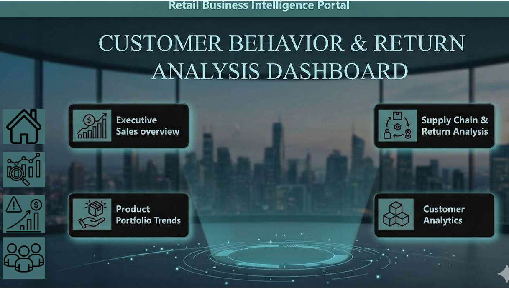
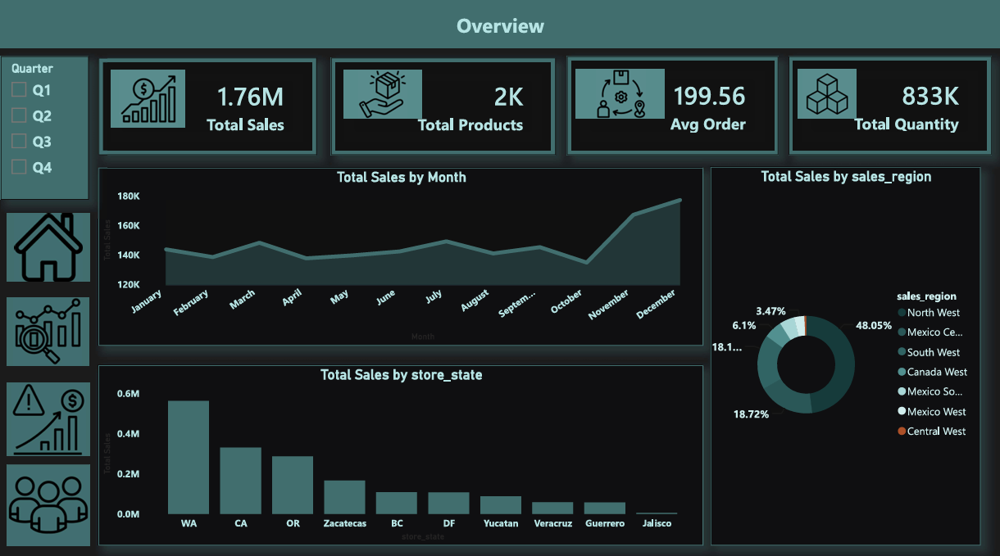
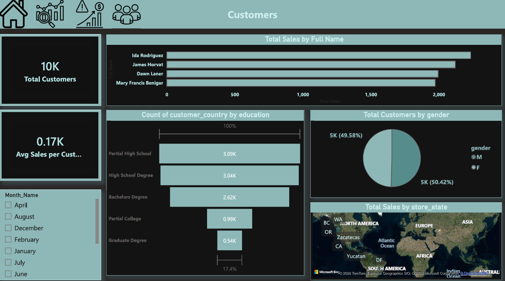

# Product Returns Analysis – Power BI

## Overview

An interactive Power BI dashboard developed to analyze product returns and identify patterns across products, regions, and customer segments.

## Tools & Techniques

* Power BI
* Power Query
* DAX
* Data Modeling
* Data Visualization

## Dashboard Pages

* **Home** – Project landing page and navigation
* **Overview** – High-level KPIs and overall performance
* **Return Analysis** – Detailed analysis of product returns
* **Customers** – Customer segmentation and return insights

## Key Analysis

* Total Returned Quantity
* Return Rate
* Returns by Product Brand
* Returns by Region
* Returns by Income Category
* Top Products by Return Quantity

## Dashboard Preview

### Home

### Overview

### Return Analysis

### Customers

## Project File

* `Returns_Analysis.pbix` – Power BI report
